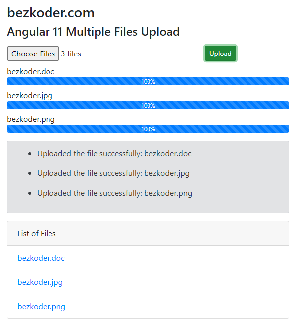

# Angular 11 Multiple File upload example with Progress bar

In this tutorial, I will show you way to build Multiple Files upload example using Angular 11, Bootstrap and FormData with Progress Bars.

For more detail, please visit:
> [Angular 11 Multiple Files upload example with Progress bar & Bootstrap](https://bezkoder.com/angular-11-multiple-file-upload/)

Rest APIs server for this Angular Client:
> [Node.js Express File Upload Rest API example](https://bezkoder.com/node-js-express-file-upload/)

> [Spring Boot Multipart File upload (to static folder) example](https://bezkoder.com/spring-boot-file-upload/)

> [Spring Boot Multipart File upload (to database) example](https://bezkoder.com/spring-boot-upload-file-database/)

More practice:
> [Angular 11 Upload File to Firebase Storage example](https://bezkoder.com/angular-11-file-upload-firebase-storage/)

> [Angular 11 JWT Authentication example with Web Api](https://bezkoder.com/angular-11-jwt-auth/)

> [Angular 11 CRUD Application example with Web API](https://bezkoder.com/angular-11-crud-app/)

## Development server

Run `ng serve --port 8081` for a dev server. Navigate to `http://localhost:8081/`. The app will automatically reload if you change any of the source files.

## Code scaffolding

Run `ng generate component component-name` to generate a new component. You can also use `ng generate directive|pipe|service|class|guard|interface|enum|module`.

## Build

Run `ng build` to build the project. The build artifacts will be stored in the `dist/` directory. Use the `--prod` flag for a production build.

## Running unit tests

Run `ng test` to execute the unit tests via [Karma](https://karma-runner.github.io).

## Running end-to-end tests

Run `ng e2e` to execute the end-to-end tests via [Protractor](http://www.protractortest.org/).

## Further help

To get more help on the Angular CLI use `ng help` or go check out the [Angular CLI README](https://github.com/angular/angular-cli/blob/master/README.md).
